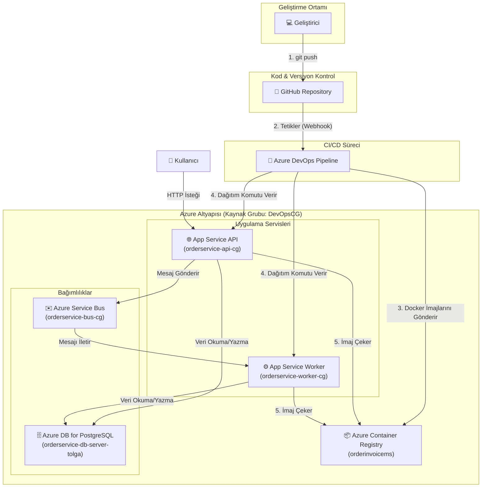

```mermaid
graph TD
    subgraph "Geliştirme Ortamı"
        Developer["💻 Geliştirici"]
    end

    subgraph "Kod & Versiyon Kontrol"
        GitHub["🐙 GitHub Repository"]
    end

    subgraph "CI/CD Süreci"
        AzureDevOps["🚀 Azure DevOps Pipeline"]
    end

    subgraph "Azure Altyapısı (Kaynak Grubu: DevOpsCG)"
        ACR["📦 Azure Container Registry<br>(orderinvoicems)"]
        
        subgraph "Uygulama Servisleri"
            AppServiceAPI["🌐 App Service API<br>(orderservice-api-cg)"]
            AppServiceWorker["⚙️ App Service Worker<br>(orderservice-worker-cg)"]
        end
        
        subgraph "Bağımlılıklar"
            PostgreSQL["🗄️ Azure DB for PostgreSQL<br>(orderservice-db-server-tolga)"]
            ServiceBus["✉️ Azure Service Bus<br>(orderservice-bus-cg)"]
        end
    end

    User["👤 Kullanıcı"]

    Developer -- "1. git push" --> GitHub
    GitHub -- "2. Tetikler (Webhook)" --> AzureDevOps
    AzureDevOps -- "3. Docker İmajlarını Gönderir" --> ACR
    AzureDevOps -- "4. Dağıtım Komutu Verir" --> AppServiceAPI
    AzureDevOps -- "4. Dağıtım Komutu Verir" --> AppServiceWorker
    
    AppServiceAPI -- "5. İmaj Çeker" --> ACR
    AppServiceWorker -- "5. İmaj Çeker" --> ACR

    User -- "HTTP İsteği" --> AppServiceAPI
    AppServiceAPI -- "Veri Okuma/Yazma" --> PostgreSQL
    AppServiceAPI -- "Mesaj Gönderir" --> ServiceBus
    ServiceBus -- "Mesajı İletir" --> AppServiceWorker
    AppServiceWorker -- "Veri Okuma/Yazma" --> PostgreSQL
```