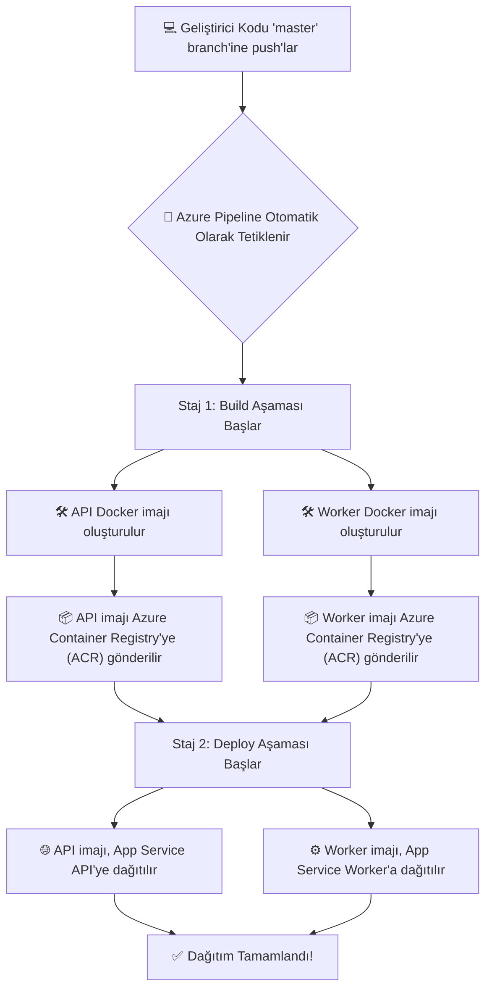

```mermaid
graph TD
    A["💻 Geliştirici Kodu 'master' branch'ine push'lar"] --> B{"🚀 Azure Pipeline Otomatik Olarak Tetiklenir"};
    B --> C["Staj 1: Build Aşaması Başlar"];
    C --> D["🛠️ API Docker imajı oluşturulur"];
    C --> E["🛠️ Worker Docker imajı oluşturulur"];
    D --> F["📦 API imajı Azure Container Registry'ye (ACR) gönderilir"];
    E --> G["📦 Worker imajı Azure Container Registry'ye (ACR) gönderilir"];
    F & G --> H["Staj 2: Deploy Aşaması Başlar"];
    H --> I["🌐 API imajı, App Service API'ye dağıtılır"];
    H --> J["⚙️ Worker imajı, App Service Worker'a dağıtılır"];
    I & J --> K["✅ Dağıtım Tamamlandı!"];
```