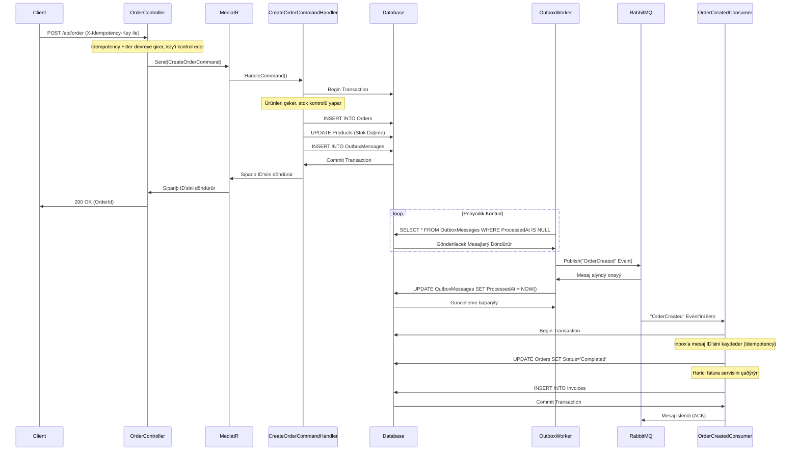

```mermaid
sequenceDiagram
    participant Client
    participant API as OrderController
    participant MediatR
    participant App as CreateOrderCommandHandler
    participant Database
    participant OutboxWorker
    participant RabbitMQ
    participant Consumer as OrderCreatedConsumer

    Client->>API: POST /api/order (X-Idempotency-Key ile)
    Note over API: Idempotency Filter devreye girer, key'i kontrol eder
    API->>MediatR: Send(CreateOrderCommand)
    MediatR->>App: HandleCommand()

    App->>Database: Begin Transaction
    Note over App: Ürünleri çeker, stok kontrolü yapar
    App->>Database: INSERT INTO Orders
    App->>Database: UPDATE Products (Stok Düþme)
    App->>Database: INSERT INTO OutboxMessages
    Database->>App: Commit Transaction

    App->>MediatR: Sipariþ ID'sini döndürür
    MediatR->>API: Sipariþ ID'sini döndürür
    API->>Client: 200 OK (OrderId)

    loop Periyodik Kontrol
        OutboxWorker->>Database: SELECT * FROM OutboxMessages WHERE ProcessedAt IS NULL
        Database->>OutboxWorker: Gönderilecek Mesajlarý Döndürür
    end

    OutboxWorker->>RabbitMQ: Publish("OrderCreated" Event)
    RabbitMQ->>OutboxWorker: Mesaj alýndý onayý

    OutboxWorker->>Database: UPDATE OutboxMessages SET ProcessedAt = NOW()
    Database->>OutboxWorker: Güncelleme baþarýlý

    RabbitMQ->>Consumer: "OrderCreated" Event'ini iletir
    Consumer->>Database: Begin Transaction
    Note over Consumer: Inbox'a mesaj ID'sini kaydeder (Idempotency)
    Consumer->>Database: UPDATE Orders SET Status='Completed'
    Note over Consumer: Harici fatura servisini çaðýrýr
    Consumer->>Database: INSERT INTO Invoices
    Database->>Consumer: Commit Transaction
    Consumer->>RabbitMQ: Mesaj islendi (ACK)
```